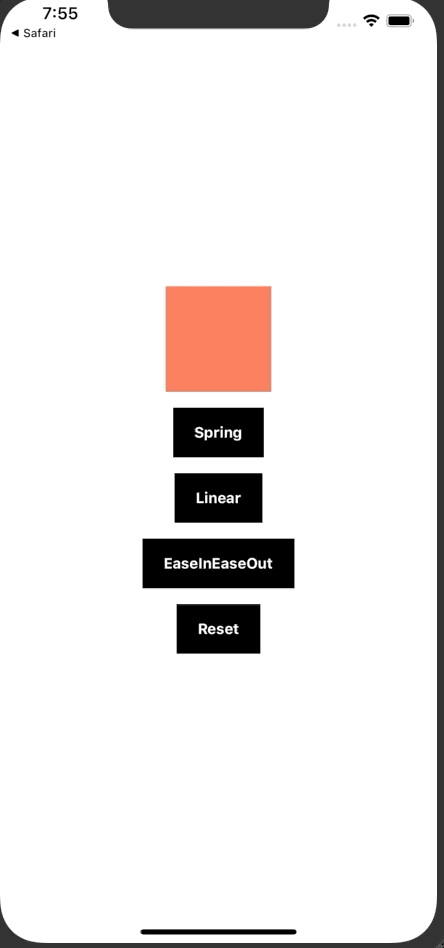

# useStateWithLayoutAnimation
Abstraction for `React Native`'s `LayoutAnimation` and `useState`

## Install
`yarn add use-state-with-layout-animation`

Or

`npm install --save use-state-with-layout-animation`

## Example



[Download expo client and scan the QR code to run the snack on your `iOS` or `Android` device](https://snack.expo.io/@iamkarlmarx/usestatewithlayoutanimation). (It does not work on web)

## API

### `useStateWithLayoutAnimation`
By default, `UIManager.setLayoutAnimationEnabledExperimental` is invoked, you can pass `false` as the second parameter if you want to call it on your own.
```
const [state, setState] = useStateWithLayoutAnimation(123, false);
```
### `setState.spring`
### `setState.linear`
### `setState.easeInEaseOut`
You can use this the same as `useState` setter, accepts values or optional callback function but accepts a second parameter for the animation finish callback.
```ts
const [state, setState] = useStateWithLayoutAnimation(1);

const animationDidFinish = () => console.log('Animation finished');

setState.spring(2, animationDidFinish);
setState.linear(prev => prev + 10, animationDidFinish);
setState.easeInEaseOut(4, animationDidFinish);
```

### `setState.noAnimation`
You can use this the same as `useState` setter, accepts values or optional callback function.
```ts
setState.noAnimation(4);
setState.noAnimation(prev => prev + 1);
```


## License
[MIT](https://github.com/karlmarxlopez/useStateWithLayoutAnimation/blob/master/LICENSE)